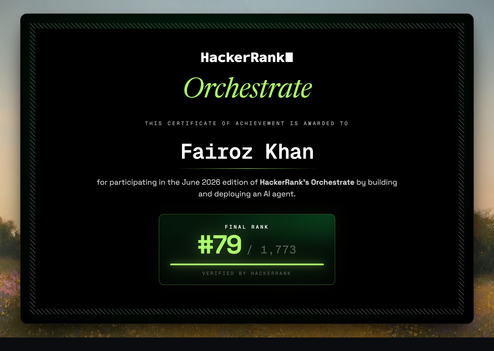

# Multi-Modal Evidence Review Pipeline

**HackerRank Orchestrate, June 2026 — Rank #79 / 1,773**



A production-style system that adjudicates damage claims (car, laptop, package) by
treating submitted images as the primary source of truth. User conversation is
evidence; history and rules provide context. Each claim produces one structured
14-column CSV row.

## Architecture

A balanced two-call pipeline: one multimodal vision call extracts per-image
findings, one text-only decision call reasons over those findings. Everything
else is deterministic.

```
INGEST -> VISION(model) -> SUFFICIENCY(det) -> DECISION(model) -> RISK(det) -> ASSEMBLE(det) -> output.csv
```

| Stage | Type | Responsibility |
|---|---|---|
| Vision | model (multimodal) | Per-image findings + cross-image consistency |
| Sufficiency | deterministic | Is evidence good enough? NEI boundary |
| Decision | model (text-only) | claim_status, issue, part, severity |
| Risk | deterministic | Fraud/abuse flags, manual_review_required |
| Assemble | deterministic | Coherence rules, valid_image, enum snapping, 14-column schema |

Only two of five stages call the model. The other three are reproducible,
auditable, and free.

## Configuration Selection

Ran a controlled four-way experiment (A/B/C/D), changing one variable per config:

| Config | Change | claim_status accuracy |
|---|---|---|
| A | baseline prompts | 0.60 |
| B | calibrated prompts (`_b`) | 0.65 |
| **C** | **consistency = signal only** | **0.75** |
| D | consistency + "never supported" cap | 0.65 (= B) |

**Shipped Config C.** The cross-image consistency signal has a ~75% false-positive
rate on multi-image claims. Config B hard-blocked on it, turning 6 legitimate
claims into false NEI. Config C demotes it to a risk and decision signal,
recovering those claims. Config D proved a safety cap cannot fix the signal
quality without re-breaking the legitimate claims.

## Run

```bash
pip install -r code/requirements.txt
```

Set your API key in a `.env` file or `config/api_keys.txt` (one key per line):

```
GEMINI_API_KEY=your_key_here
```

Generate predictions (Config C):

```bash
python code/main.py --variant _b --consistency-soft
```

Other commands:

```bash
# Evaluate all configurations
python code/evaluation/main.py

# Offline / no API key (mock backend)
python code/main.py --vision-provider mock --decision-provider mock

# Use a different Gemini model
python code/main.py --variant _b --consistency-soft --model gemini-2.5-flash-lite
```

## Reliability

- **Response cache** (content-hash): re-runs and config comparisons cost no new
  calls when prompts haven't changed.
- **Claim-level result store + checkpoint**: interrupted runs resume for free.
  Quota failures are incomplete, never persisted half-done.
- **Multi-key failover with round-robin**: unbounded API keys from
  `config/api_keys.txt`, automatic rotation and cooldown on rate limits.
- **Schema safety**: enum snapping + coherence rules make an out-of-spec or
  self-contradictory row structurally impossible.
- **Deterministic**: temperature 0, fixed model, disk cache. Repeated runs produce
  identical output.

## Security

Three-layer prompt-injection defense:

1. System-prompt firewall: text in evidence is never an instruction.
2. Decision-time reinforcement: the model is reminded before every verdict.
3. Trilingual regex scanner (English, Hinglish, Spanish): flags injection attempts
   in user claims and routes to manual review.

In-image instruction stickers are detected and flagged, never obeyed.

## Layout

```
code/
  main.py              entry point
  config.py            vocabularies, paths, model settings
  schemas.py           typed outputs with enum snapping
  ingest.py            load and join CSVs, resolve images
  imaging.py           downscale + base64
  vision.py            call 1: image findings
  sufficiency.py       deterministic evidence gate
  decide.py            call 2: final decision
  risk.py              deterministic risk flags
  assemble.py          coherence + final row
  orchestrator.py      per-claim flow with fallback
  providers/           gemini (single + multikey), mock, base
  prompts/             vision/decision system + user templates
  utils/               cache, metrics, resume
  evaluation/          controlled experiment runner + report
interview_prep/        interview preparation materials
dataset/               claims, images, history, requirements
```

## Honest Caveats

- Config C can false-approve a genuinely different-object image set (the planted
  `case_002`). It is still flagged for manual review. Measured, understood, chosen
  deliberately.
- Severity accuracy (0.30) and contradiction recall (0.40) are the weakest columns.
  This is the honest ceiling of a prompt-only approach without fine-tuning.
- Evaluation sample is n=20. All numbers are directional; tuning was limited to
  one measured change per experiment to avoid overfitting.
